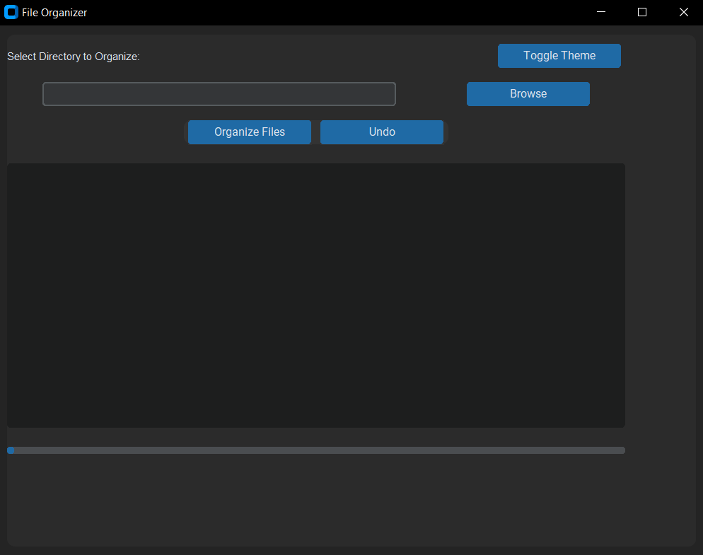

# Folder Organizer 🗂️

**Folder Organizer** is a powerful Python tool designed to automatically organize your cluttered directories by categorizing files based on their extensions. Comes with a GUI, test file generator, and extension analysis tools!

[](https://www.python.org/)
[](LICENSE)



## Features ✨

- **Automatic File Categorization**  
  Supports 40+ categories (Documents, Images, Code, etc.) with 500+ file extensions
- **Undo Functionality**  
  Revert file organization with a single click/command
- **GUI Interface**  
  User-friendly graphical interface with dark/light theme support
- **Customizable Categories**  
  Easily add/remove file extensions and categories
- **Helper Tools**  
  - Test file generator for stress testing
  - Extension analyzer for debugging category conflicts
- **Cross-Platform**  
  Works on Windows, macOS, and Linux

## Installation 🛠️

1. **Requirements**
   - Python 3.11+
   ```bash
   git clone https://github.com/comertial/FolderOrganizer.git
   cd folderOrganizer
   ```

2. **Install Dependencies**
   ```bash
   pip install -r requirements.txt
   ```

## Building Executable with PyInstaller 🛠️

You can create a standalone executable for the GUI interface using PyInstaller. This allows users to run the application without needing Python installed.

### Steps to Build the Executable

1. **Build the Executable**  
   Use the provided `FolderOrganizer.spec` file to create the executable:
   ```bash
   pyinstaller FolderOrganizer.spec
   ```

2. **Find the Executable**  
   The generated executable will be located in the `dist` directory. Look for `FolderOrganizer.exe` (Windows) or `FolderOrganizer` (macOS/Linux).

## Usage 🚀

### Basic Organization (CLI)
```bash
python folderOrganizer.py
# Follow prompts to select directory
```

### Graphical Interface
```bash
python gui.py
```

### Generate Test Files
```bash
python generator.py
```

### Analyze Extensions
```bash
python extensionAnalyzer.py
```

## Key Components 📦

| File | Description |
|------|-------------|
| `folderOrganizer.py` | Core organization logic |
| `gui.py` | Graphical user interface |
| `generator.py` | Test file generator |
| `extensionAnalyzer.py` | Extension conflict checker |

## Advanced Features 🔧

**Customize Categories**  
Modify the `extension_maps` dictionary in `folderOrganizer.py` to add new categories:
```python
organizer.add_extension_category('NewCategory', ['.ext1', '.ext2'])
```

**Undo**  
In GUI: Click "Undo" button  
In CLI: Use `undo_last_operation()` method

## Contributing 🤝

Contributions welcome! Please follow these steps:
1. Fork the repository
2. Create your feature branch (`git checkout -b feature/AmazingFeature`)
3. Commit your changes (`git commit -m 'Add some AmazingFeature'`)
4. Push to the branch (`git push origin feature/AmazingFeature`)
5. Open a Pull Request

## License 📄

This project is licensed under the MIT License - see the [LICENSE](LICENSE) file for details.

---

**Pro Tip:** Use the test file generator to create sample data before organizing important directories! 🧪
